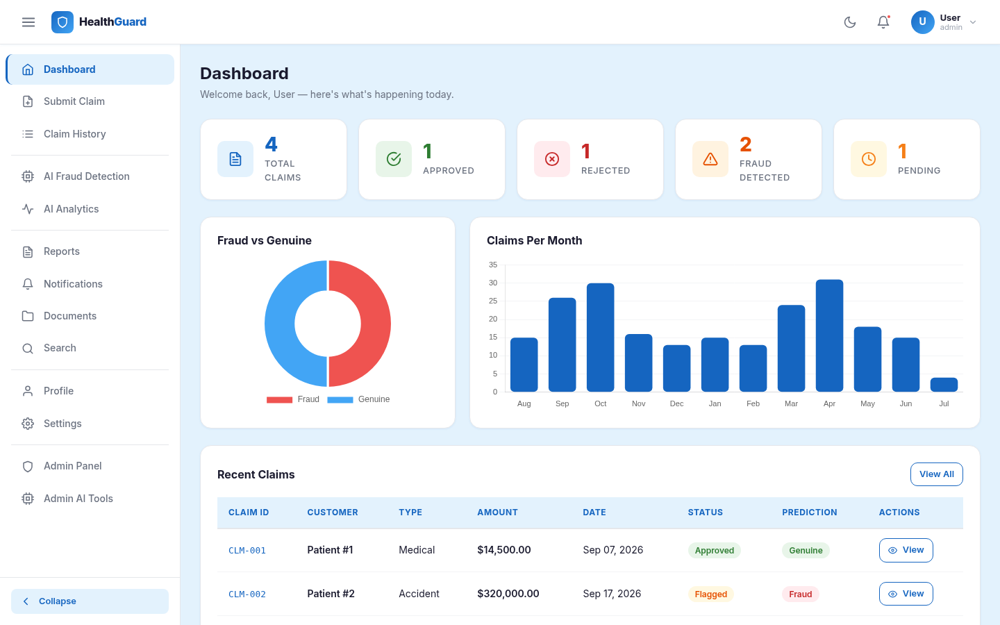
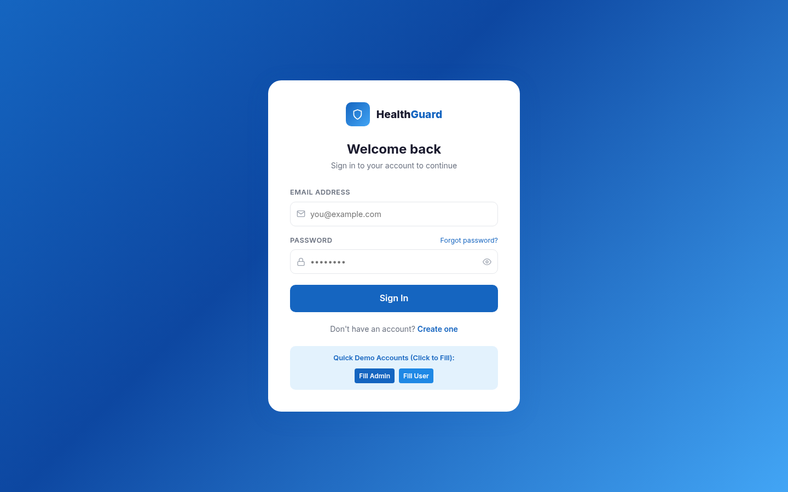
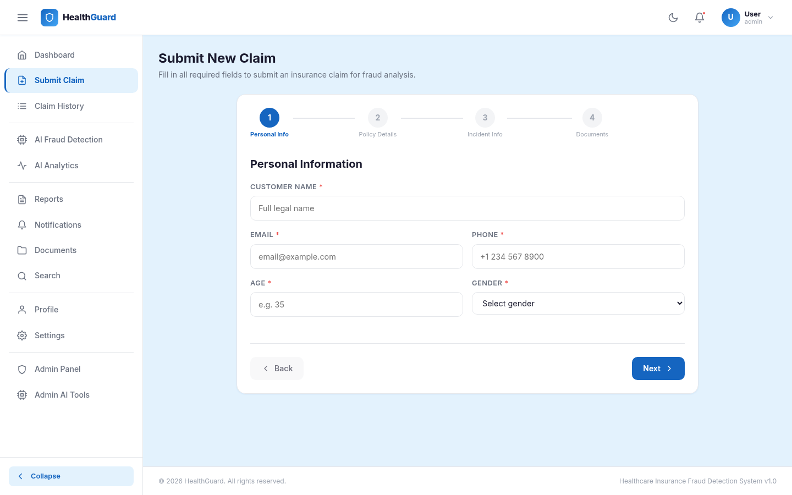
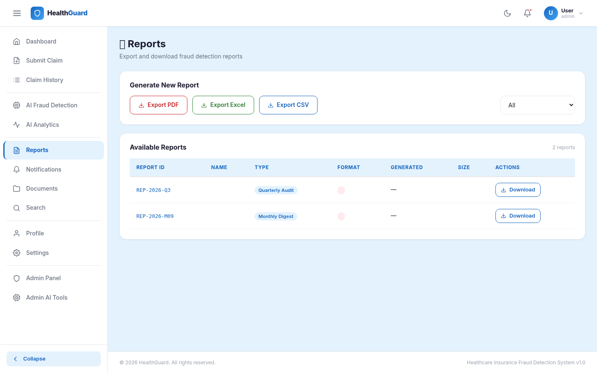
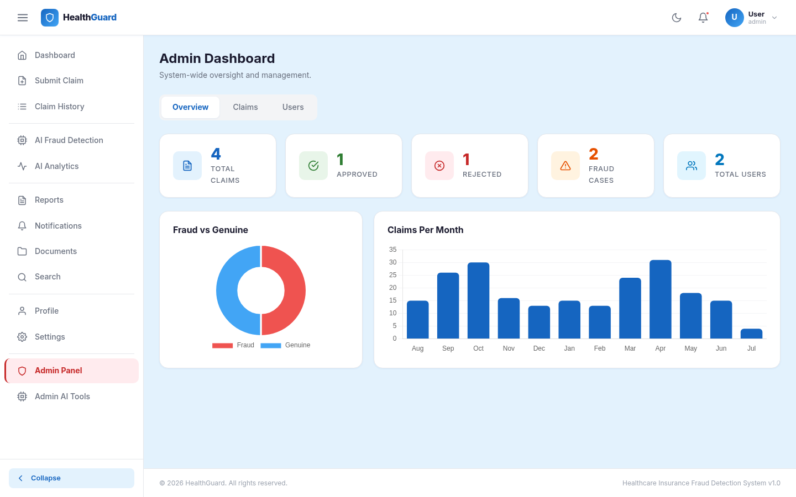
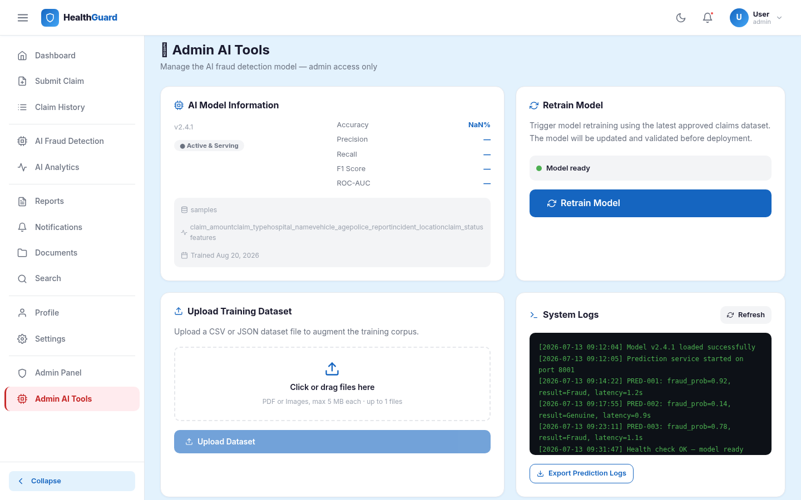

# 🛡️ HealthGuard — Healthcare Insurance Fraud Detection & Blockchain Registry

An enterprise-grade, full-stack healthcare insurance claim analysis and fraud prevention platform. HealthGuard unites **machine learning fraud detection**, **explainable AI (XAI)**, **document integrity verification**, and an **immutable Ethereum blockchain registry** to audit, score, and protect insurance claim lifecycles against fraudulent billing and tampering.

---

## 📸 Original Application Screenshots

Every screenshot below is captured directly from the live HealthGuard web application across all functional routes:

### 1. 📊 Executive Dashboard (`/dashboard`)
The central command center providing live operational statistics: total claims, active fraud flags, financial exposure metrics, real-time risk distribution, and claims requiring review.



---

### 2. 🔐 Authentication & Access Portal (`/login`)
Secure login gateway featuring role-based authentication (Admin, Investigator/Auditor, Policyholder) with JWT token issuance and password encryption.



---

### 3. 📝 Submit Claim Tab (`/submit-claim`)
Comprehensive insurance filing interface capturing patient demographics, insurance policy IDs, medical diagnosis codes (ICD-10), procedure codes (CPT), admission duration, and billing breakdowns, alongside medical document attachment with automated SHA-256 integrity calculation.



---

### 4. 📑 Fraud Investigation Reports (`/reports`)
Comprehensive reporting interface providing analytical summaries, fraud risk categorizations, approved vs. rejected claim ratios, and downloadable audit documentation for regulatory compliance.



---

### 5. 🛡️ Admin Management Console (`/admin`)
Administrative oversight panel displaying overall system health, registered user accounts, role permission assignments, and live streaming of audit log events across the entire organization.



---

### 6. ⚙️ Admin AI Model Retraining Tools (`/admin/ai-tools`)
Dedicated administrative operations portal enabling model retraining with fresh datasets, confusion matrix evaluations, feature weighting adjustments, and live performance benchmark comparisons.



---

## 🌟 Core System Capabilities

### 1. 🤖 Multi-Tier Fraud Scoring Pipeline
- **Instant Risk Categorization**: Claims receive continuous scores from 0.0 to 1.0, categorized into Low (<0.35), Medium (0.35–0.65), High (0.65–0.85), and Critical (>0.85).
- **Explainable AI (XAI)**: Identifies exactly *why* a claim was flagged, highlighting billing outliers, diagnosis code discrepancies, length-of-stay anomalies, or provider repeat billing.
- **Dual-Engine Architecture**: Operates with Python Scikit-Learn models (`predict.py`, `train_model.py`) or seamlessly falls back to the embedded zero-dependency JavaScript anomaly detector for serverless and containerized deployments.
- **Live Retraining**: One-click model retraining trigger with dynamic accuracy benchmarking.

### 2. ⛓️ Ethereum Blockchain Registry
- **Smart Contract (`InsuranceFraudRegistry.sol`)**: Stores unique cryptographic `bytes32` hashes of claim payloads and AI predictions.
- **Tamper Detection**: Compares current database records against immutable on-chain hashes to instantly flag manual record modifications or malicious database edits.
- **RPC & Local Ledger Flexibility**: Connects to live Ethereum/Polygon JSON-RPC endpoints or runs with an in-memory simulated ledger when offline.

### 3. 📄 Document Integrity & SHA-256 Verification
- **Secure File Storage**: Upload medical bills, lab results, and discharge summaries via Multer.
- **Cryptographic Fingerprinting**: Files receive SHA-256 checksums at upload time to guarantee that attached medical records are not altered after filing.

### 4. 🔐 Security & Role-Based Access Control (RBAC)
- **Role Hierarchy**: Strict permission gates for `Admin`, `Auditor` / `Investigator`, and standard `User` / `Policyholder`.
- **Stateless JWT Tokens**: Tokens signed with configurable secrets and verified by Express authentication middleware.
- **Audit Trails**: Every claim status update, login event, and blockchain verification is immutably logged.

---

## 🏗️ Technical Architecture

```text
┌─────────────────────────────────────────────────────────────┐
│                 React 19 SPA (Vite 6)                       │
│  - Executive Dashboard, Claim Form & File Uploader          │
│  - Real-Time Risk Gauge & Explainable AI Breakdown          │
│  - Chart.js Visual Analytics & Blockchain Hash Verifier     │
└──────────────────────────────┬──────────────────────────────┘
                               │ HTTP / REST APIs
┌──────────────────────────────▼──────────────────────────────┐
│                 Node.js 22 + Express API                    │
│  - JWT Authentication & RBAC Middleware                     │
│  - Claim Controller, Document Hasher & Audit Logger         │
│  - Unified Vite Development & Production Static Server      │
└──────────────┬──────────────────────────────┬───────────────┘
               │                              │
    ┌──────────▼──────────┐        ┌──────────▼──────────┐
    │  AI / ML Engine     │        │ Blockchain Registry │
    │  - Python Scikit-   │        │ - Ethers.js v6      │
    │    Learn Model      │        │ - InsuranceFraud-   │
    │  - JS Anomaly Fall- │        │    Registry.sol     │
    │    back Engine      │        │ - On-Chain Hashes   │
    └─────────────────────┘        └─────────────────────┘
               │                              │
    ┌──────────▼──────────────────────────────▼──────────┐
    │  Database Layer: MySQL / In-Memory Mock Store      │
    │  - Claims, Predictions, Audit Logs, Documents, Users│
    └────────────────────────────────────────────────────┘
```

---

## 🛠️ Technology Stack

| Layer | Technologies |
| :--- | :--- |
| **Frontend** | React 19, Vite 6, React Router DOM v6, React Icons, Chart.js, react-chartjs-2, CSS3 Variables |
| **Backend** | Node.js 22, Express 4, Multer, JsonWebToken, BcryptJS |
| **Database** | MySQL (via `mysql2`) with resilient automatic In-Memory Database store |
| **Machine Learning** | Python 3, Scikit-Learn, Pandas, NumPy, Joblib, JS Anomaly Engine |
| **Blockchain** | Solidity 0.8.x, Ethers.js v6, Hardhat, Mocha/Chai Test Suite |

---

## 🚀 Getting Started

### Prerequisites
- **Node.js**: v18.x or v20+ / v22+
- **npm**: v9+
- *(Optional)* **Python**: v3.9+ (for external model retraining scripts)
- *(Optional)* **MySQL**: v8.0+
- *(Optional)* **Hardhat / Localhost Ethereum Node**: for live blockchain interaction

### 1. Clone the Repository
```bash
git clone https://github.com/AyushNinawe/AyushNinawe.git
cd AyushNinawe
```

### 2. Install Dependencies
```bash
npm install
```

### 3. Environment Configuration
Create a `.env` file from `.env.example`:
```bash
cp .env.example .env
```

Default configuration variables:
```ini
# Server Port (Default is 3000)
PORT=3000

# Database Configuration (MySQL)
DB_HOST=localhost
DB_PORT=3306
DB_USER=root
DB_PASSWORD=YourPassword
DB_NAME=insurance_fraud_detection

# JWT Authentication
JWT_SECRET=HFD_2026_9xK7mP2qL8vR4tN6ksacbkj

# Blockchain Configuration (Hardhat / Localhost / Testnet)
BLOCKCHAIN_CONTRACT_ADDRESS=0xCf7Ed3AccA5a467e9e704C703E8D87F634fB0Fc9
BLOCKCHAIN_RPC_URL=http://127.0.0.1:8545
BLOCKCHAIN_NETWORK=localhost
BLOCKCHAIN_PRIVATE_KEY=0xac0974bec39a17e36ba4a6b4d238ff944bacb478cbed5efcae784d7bf4f2ff80
```

> 💡 **Instant Run Mode**: If no external MySQL database or Ethereum RPC is running, HealthGuard automatically launches in resilient mode using the pre-seeded in-memory store and simulated ledger, ensuring zero crash risk.

### 4. Run the Full-Stack Application
Start the unified full-stack server (Express backend + Vite React client):
```bash
npm run dev
```

Visit the application in your browser:
```text
http://localhost:3000
```

---

## 🔑 Pre-Configured Demo Credentials

| Role | Email | Password | Permissions |
| :--- | :--- | :--- | :--- |
| **Administrator** | `admin@healthguard.io` | `Admin@1234` | Full access, Retrain Model, User management, Status overrides |
| **Auditor / Investigator** | `auditor@healthguard.io` | `Auditor@1234` | Claim evaluation, Review actions, Blockchain verification, Audit logs |
| **Policyholder / User** | `user@healthguard.io` | `User@1234` | Submit claims, View personal history, Upload medical bills |

---

## 📡 API Endpoints Summary

### Authentication (`/api/auth`)
| Method | Endpoint | Description |
| :--- | :--- | :--- |
| `POST` | `/api/auth/register` | Create a new user account |
| `POST` | `/api/auth/login` | Authenticate and obtain JWT token |
| `GET` | `/api/auth/profile` | Retrieve authenticated profile |
| `PUT` | `/api/auth/profile` | Update user details |
| `PUT` | `/api/auth/change-password` | Update account password |

### Claims Management (`/api/claims`)
| Method | Endpoint | Description |
| :--- | :--- | :--- |
| `GET` | `/api/claims` | List claims with pagination, status filters, and search |
| `GET` | `/api/claims/:id` | Fetch specific claim details with attachments |
| `POST` | `/api/claims` | Submit a new claim with automated AI fraud scoring |
| `PATCH`| `/api/claims/:id/status` | Update claim workflow status (Approved, Flagged, etc.) |

### AI Predictions & Analytics (`/api`)
| Method | Endpoint | Description |
| :--- | :--- | :--- |
| `POST` | `/api/predict` | Calculate fraud risk score for a claim payload |
| `GET` | `/api/prediction-history` | View historical claim risk predictions |
| `GET` | `/api/analytics` | Aggregate fraud rates, trends, and risk distributions |
| `GET` | `/api/model-info` | Telemetry on model accuracy, precision, and version |
| `POST` | `/api/retrain-model` | Trigger model retraining on current dataset |

### Blockchain Verification (`/api/blockchain`)
| Method | Endpoint | Description |
| :--- | :--- | :--- |
| `POST` | `/api/blockchain/store-claim-hash` | Anchor claim record hash to smart contract |
| `POST` | `/api/blockchain/store-prediction-hash` | Anchor prediction hash to smart contract |
| `GET` | `/api/blockchain/verify-claim/:claimId` | Verify DB claim record against on-chain hash |
| `GET` | `/api/blockchain/verify-prediction/:predictionId` | Verify prediction record against on-chain hash |
| `GET` | `/api/blockchain/claim-record/:claimId` | Read on-chain block metadata and submitter address |

### Documents (`/api/documents`)
| Method | Endpoint | Description |
| :--- | :--- | :--- |
| `POST` | `/api/documents/upload` | Upload medical document with SHA-256 fingerprinting |
| `GET` | `/api/documents/claim/:claimId` | Retrieve all documents attached to a claim |

---

## 📂 Project Directory Structure

```text
├── backend/
│   ├── config/             # DB & Blockchain connection configs
│   ├── contracts/          # Solidity smart contracts (InsuranceFraudRegistry.sol)
│   ├── controllers/        # Express controllers (Auth, Claims, AI, Blockchain, Admin)
│   ├── middleware/         # Auth & Admin JWT verification middlewares
│   ├── migrations/         # SQL schema migration scripts
│   ├── python/             # Python ML training pipeline (train_model.py, predict.py)
│   ├── routes/             # REST API route handlers
│   ├── services/           # Blockchain (Ethers.js) & AI prediction services
│   └── uploads/            # Uploaded medical invoices and reports
├── frontend/
│   ├── public/
│   │   └── screenshots/    # Publicly accessible UI screenshots
│   ├── src/
│   │   ├── components/     # UI widgets: RiskMeter, FraudGauge, Navbar, Sidebar
│   │   ├── context/        # AuthContext, ToastContext, SettingsContext
│   │   ├── pages/          # All tab pages (Dashboard, Submit, Prediction, Analytics, Admin)
│   │   └── services/       # Frontend Axios API client
│   ├── index.html          # HTML5 entry point
│   └── vite.config.js      # Vite build configuration
├── screenshots/            # Repository documentation screenshots
│   ├── dashboard_preview.png
│   ├── login_page.png
│   ├── submit_claim.png
│   ├── prediction_result.png
│   ├── ai_analytics.png
│   ├── blockchain_audit.png
│   ├── advanced_search.png
│   ├── reports.png
│   ├── admin_dashboard.png
│   └── admin_tools.png
├── server.js               # Unified Express + Vite full-stack server
├── metadata.json           # Application metadata & capabilities
└── package.json            # Root configuration and dependencies
```

---

## 📜 License

This project is licensed under the **MIT License**.
# HealthGuard_Project
